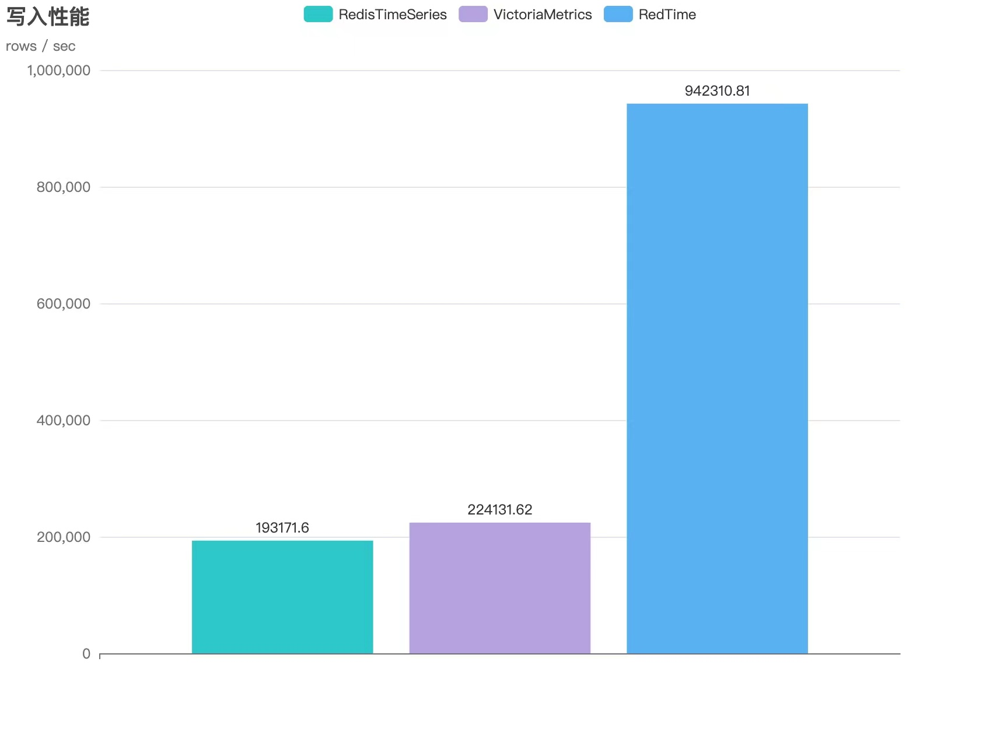

<!--
 * @Author: gitsrc
 * @Date: 2022-04-02 14:21:40
 * @LastEditors: gitsrc
 * @LastEditTime: 2022-04-02 17:34:51
 * @FilePath: /RedTimeDB/README.md
-->

# RedTimeDB
The next-generation time series database builds ultra-high-speed write and query performance based on the memory model, and has remote persistent write support. Welcome to experience a faster time series database.

1. Ultra-high data write performance.
2. Excellent remote data persistence support.
3. Support cluster horizontal expansion.
4. Support community popular chart system.
5. Support multiple protocols for write access: MQTT, HTTP, RESP.
# Model test
## metrics throughput

## rows throughput

# Command support
## TS.ADD
### Instruction description
### Example of use

## TS.GET
### Instruction description
### Example of use
## TS.MADD
### Instruction description
### Example of use
## TS.MGET
### Instruction description
### Example of use

# Thanks 

### I stood on the shoulders of giants and did only simple things. Thank you for your attention.

* https://github.com/nakabonne/tstorage
* https://github.com/panjf2000/gnet

# Disclaimers
When you use this software, you have agreed and stated that the author, maintainer and contributor of this software are not responsible for any risks, costs or problems you encounter. If you find a software defect or BUG, ​​please submit a patch to help improve it!

